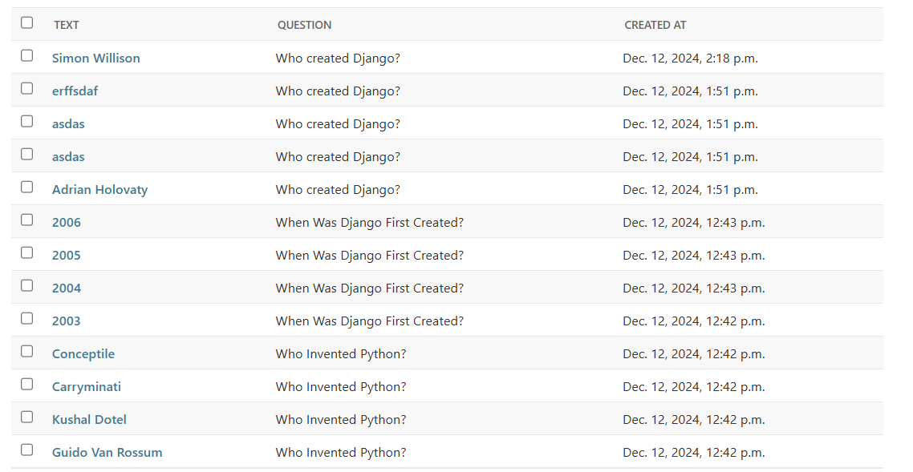
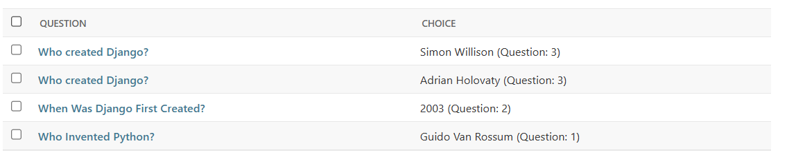

This is the admin panel from where admin will insert categories, questions, it's relevant choices and Answers.

This is the categories based on heirarchical structure.

This is a simple Questions set for different category

This is a simple choices for multiple questions.

These are the relevant answers to the question. If a question is of sigle choice then it can have only one answer. But if it is of multiple choice it can have multiple answers.

This is a quiz by category. A user can have quiz based on various categories and sub-categories.

