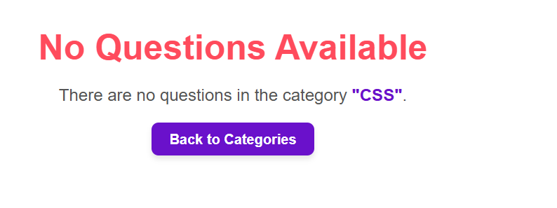

This is the admin panel from where admin will insert categories, questions, it's relevant choices and Answers.

This is the categories based on heirarchical structure.

This is a simple Questions set for different category

This is a simple choices for multiple questions.

These are the relevant answers to the question. If a question is of sigle choice then it can have only one answer. But if it is of multiple choice it can have multiple answers.

This is a quiz by category. A user can have quiz based on various categories and sub-categories.

This is how a quiz looks like. If a category has more that 10 questions then only 10 random questions are displayed. If it has less than 10 questions then all of them are displayed.

This is how selection of answer looks like.

This is how the feedback with score is shown.

This is how exceprion and no questions are handled if any category donot have any question.